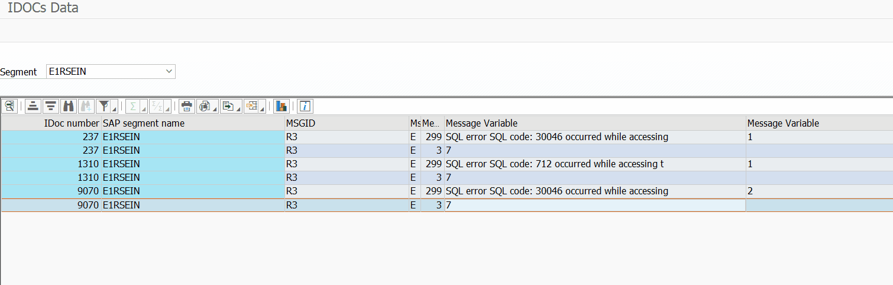

# Dynamic Table

This is a utility ABAP class that can be helpful to manage and handle dynamic tables. 

It enables you to create dynamic tables easily, transpose tables by reversing rows and columns, and interact with dynamically created tables to extract rows or columns.

## Requirements
ABAP 7.40+

☁️ Cloud Ready

## Quick Usage

### Create a table by transposition
Suppose you have a table variable `t_assets` with fields `ASSET [C(12)] | MONTH [N(2)] | VALUE [P(10) DEC 2]`
| ASSET | MONTH | VALUE |
| -- | -- | -- |
| 1 | 02 | 130.00 |
| 1 | 03 | 140.00 |
| 2 | 01 | 100.00 |
| 2 | 03 | 160.00 |
| 3 | 02 | 100.00 |
```abap
DATA(dyntab) = zcl_tbox_dyntab=>create_by_transposition(
  tab           = t_assets
  column_field  = `MONTH`
  column_value  = `VALUE`
  prefix        = `M` ).

DATA(my_tab) = dyntab->get( ).
```
What you get:
| ASSET | M01 | M02 | M03 |
| -- | -- | -- | -- |
| 1 | 0.00 | 130.00 | 140.00 |
| 2 | 100.00 | 0.00 | 160.00 |
| 3 | 0.00 | 100.00 | 0.00 |

`prefix` parameter is optional: you must set a prefix when the column used to perform the transposition contains values that cannot be directly used to name a table field.

### Create an empty table and extend it gradually
```abap
DATA(dyntab) = zcl_tbox_dyntab=>create_empty( ).

" Add a field using a data element
dyntab->add_column(
  column_name = `CARRID`
  type        = `S_CARR_ID` ).

" Add a field typed like a variable
DATA connid TYPE s_conn_id.
dyntab->add_column(
  column_name = `CONNID`
  like        = connid ).

" Add a field typed with cl_abap_typedescr reference
DATA fltime TYPE s_fltime.
dyntab->add_column(
  column_name = `FLTIME`
  type_ref    = cl_abap_typedescr=>describe_by_data( fltime ) ).

" Add a field with default type STRING
dyntab->add_column( `NEW_COLUMN` ).

" Append rows matching corresponding fields
SELECT * FROM spfli INTO TABLE @DATA(t_spfli).
dyntab->append_rows( t_spfli ).

" Get the reference to the dynamic table
DATA(my_tab) = dyntab->get( ).
```

### Create an empty table and massively extend it
```abap
DATA(dyntab) = zcl_tbox_dyntab=>create_empty( ).

DATA t_spfli TYPE TABLE OF spfli.
dyntab->extend_catalog( t_spfli ). " Adopt all fields from t_spfli
DATA t_sbook TYPE TABLE OF sbook.
dyntab->extend_catalog( t_sbook ). " Adopt all fields from t_sbook
" There is no duplication for already inserted fields

dyntab->extend_with_table( t_spfli ). " Set all rows from t_spfli
dyntab->extend_with_table( t_sbook ). " Set all rows from t_sbook by juxtaposing already inserted rows
" So the table is extended horizontally

DATA(my_tab) = dyntab->get( ).
```

### Create a table from a table variable
```abap
SELECT * FROM spfli INTO TABLE @DATA(t_spfli).
DATA(dyntab) = zcl_tbox_dyntab=>create_from_table( t_spfli ).

" You can remove a column
dyntab->del_column( `MANDT` ).

" You can add a column
dyntab->add_column( `NEW_COL` ). " No type: string type is used

DATA(my_tab) = dyntab->get( ).
```

### Create a table from a catalog
```abap
DATA(catalog) = VALUE abap_component_view_tab(
  ( name = `F1`
    type = CAST cl_abap_elemdescr( cl_abap_typedescr=>describe_by_name( `I` ) ) )
  ( name = `F2`
    type = CAST cl_abap_elemdescr( cl_abap_typedescr=>describe_by_name( `D` ) ) ) ).

DATA(dyntab) = zcl_tbox_dyntab=>create_from_cataog( catalog ).
DATA(my_tab) = dyntab->get( ).
" You get a reference to a table with two fields: `F1` typed `I` and `F2` typed `D`.
```

### Manage a dynamic table
```abap
" Append single row or lines (using corresponding fields)
dyntab->append( s_spfli ).
dyntab->append_lines( t_spfli ).

" Read single row or lines
DATA(row_no_42) = dyntab->read_index( 42 ).
DATA(row_sel)   = dyntab->read_with_keys( VALUE #( ( field = `CONNID` value = `JL` ) ) ).
DATA(rows_cond) = dyntab->read_with_condition( `DEPTIME <= '150000' AND FLTYPE = abap_true` ).

" Get a subtable with selected columns
DATA(subtab) = dyntab->get_subtable( VALUE string_table( ( `CONNID` ) ( `CARRID` ) ) ).

" Get a subtable with a unique selected column
DATA(connid_column) = dyntab->pick_column( `CONNID` ).

" Other functions
dyntab->add_index_column( ). " Add new column (called _INDEX) with row indexes
dyntab->clear( ). " Clear internal table
DATA(lines) = dyntab->count( ). " Return lines number of internal table
DATA(init)  = dyntab->is_initial( ). " Return true if internal table is initial
```

## Use Case Example
IDOC data segments explorer


## Installation
Install this project using [abapGit](https://abapgit.org/) 
